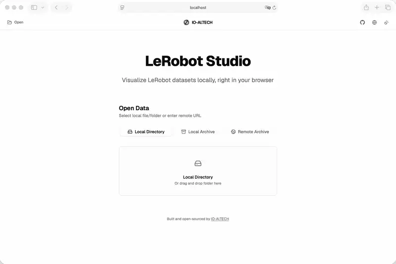

# LeRobot Studio &nbsp;·&nbsp; [在线演示 →](https://lerobot.studio)

[English — README.md](README.md)

[](https://github.com/ioai-tech/lerobot-studio/actions/workflows/ci.yml)
[](https://www.npmjs.com/package/@ioai/lerobot-studio)
[](LICENSE)
[](https://ioai-tech.github.io/lerobot-studio/)

> 在浏览器中打开 [LeRobot](https://github.com/huggingface/lerobot) 数据集，同时查看视频、图表和原始数据；也可以将同一套查看器加入 React 应用。

你可以直接使用 [lerobot.studio](https://lerobot.studio)，也可以通过 npm 安装 [`@ioai/lerobot-studio`](https://www.npmjs.com/package/@ioai/lerobot-studio) 并嵌入 React 应用。本地文件夹和压缩包会在浏览器中处理，不会上传到云端。只有打开远程链接时，浏览器才会向该链接所在的服务器请求数据。

<p align="center">
  
</p>

---

## 文档

| 文档                                      | 说明                                                 |
| ----------------------------------------- | ---------------------------------------------------- |
| [使用指南](docs/user-manual.zh-CN.md)     | 打开数据、浏览 Episode、查看面板、编辑、导出和快捷键 |
| [快速开始](docs/quick-start.zh-CN.md)     | 使用独立应用或安装 React 包                          |
| [嵌入 React](docs/embedding.zh-CN.md)     | 在自己的应用中安装和配置查看器                       |
| [API 参考](docs/api.zh-CN.md)             | `LeRobotViewer` 属性、数据源和类型                   |
| [数据格式](docs/data-formats.zh-CN.md)    | 支持的数据集版本、子任务与官方 Hub 示例              |
| [CORS 与 Range](docs/cors.zh-CN.md)       | 远程归档需要的响应头                                 |
| [浏览器支持](docs/browser.zh-CN.md)       | Chromium / Firefox / WebKit                          |
| [故障排查](docs/troubleshooting.zh-CN.md) | 常见打不开的情况                                     |
| [开发](docs/development.zh-CN.md)         | 本地环境与测试                                       |
| [部署](docs/deployment.zh-CN.md)          | Docker、Cloudflare、样例环境变量                     |
| [贡献指南](CONTRIBUTING.zh-CN.md)         | 怎么提 PR                                            |
| [安全](SECURITY.zh-CN.md)                 | 漏洞报告                                             |

文档站：[ioai-tech.github.io/lerobot-studio](https://ioai-tech.github.io/lerobot-studio/)

---

## 功能

- **打开本地或远程数据** — 文件夹、`.zip`、`.tar`、`.tar.gz`、`.tgz` 和 HTTP(S) 压缩包
- **同步查看数据** — 视频、图像、图表和原始特征保持在同一帧
- **快速浏览 Episode** — 搜索和筛选 Episode，控制播放，并使用键盘快捷键
- **检查数据集质量** — 查看数据集统计信息，导出健康检查报告
- **在独立应用中编辑和导出** — 修改 Episode 任务、删除或恢复 Episode，并导出 `v2.1` 或 `v3.0` 数据集
- **查看和标注子任务（`v3.0`）** — 官方 `subtask_index` 区间、Q/R 标注，以及完整覆盖导出（不会写入 `-1`）
- **嵌入 React** — 在 React 19 应用中使用只读查看器
- **本地数据留在本地** — 本地文件在浏览器中处理；npm 包不会收集使用数据

---

## 快速开始（网站）

打开 **[lerobot.studio](https://lerobot.studio)**，无需安装。

选择本地文件夹、本地压缩包，或粘贴远程压缩包地址。完整操作说明见 [使用指南](docs/user-manual.zh-CN.md)。

### 在本地运行项目

```bash
git clone https://github.com/ioai-tech/lerobot-studio.git
cd lerobot-studio
npm ci
npm run fixtures:generate
npm run dev          # http://localhost:5173
npm run build        # 生产包 → dist/
```

Docker：

```bash
docker build -t lerobot-studio .
docker run --rm -p 8080:8080 lerobot-studio
```

---

## 嵌入 React

React 包已以 [`@ioai/lerobot-studio`](https://www.npmjs.com/package/@ioai/lerobot-studio) 发布到 npm，安装方式：

```bash
npm install @ioai/lerobot-studio
```

> **环境要求：** `react` 和 `react-dom` `^19.0.0`、ES 模块和客户端渲染。不支持服务端渲染、React Server Components 和 Node.js。

### 样式

```tsx
import '@ioai/lerobot-studio/style.css';
```

### 基本用法

```tsx
import { LeRobotViewer } from '@ioai/lerobot-studio';
import '@ioai/lerobot-studio/style.css';

export function App() {
  return (
    <div style={{ height: 720, minHeight: 480 }}>
      <LeRobotViewer dataSource="https://example.com/dataset.zip" />
    </div>
  );
}
```

外层容器需要有明确高度。查看器会填满父元素，不会自行决定页面高度。

### Next.js（仅客户端）

```tsx
'use client';

import dynamic from 'next/dynamic';

const Viewer = dynamic(() => import('@ioai/lerobot-studio').then((m) => m.LeRobotViewer), {
  ssr: false,
});
```

更多集成示例：[嵌入指南](docs/embedding.zh-CN.md) · [API 参考](docs/api.zh-CN.md)。

---

## 支持的数据集

| `codebase_version`             | 打开               | 说明                     |
| ------------------------------ | ------------------ | ------------------------ |
| `v2.1`                         | 可查看、编辑和导出 | 完全支持                 |
| `v3.0`                         | 可查看、编辑和导出 | 完全支持                 |
| 较新的 `v2` 或 `v3` minor 版本 | 仅查看             | 不支持编辑和导出         |
| `v2.0`、其他主版本或缺失版本   | 不打开             | 应用不会猜测可兼容的版本 |

归档：`.zip`、`.tar`、`.tar.gz`、`.tgz`。

npm 包提供查看和会话内的 Episode 修改功能。导出引擎只在独立应用中提供。详见 [数据格式](docs/data-formats.zh-CN.md)。

---

## 参与贡献

提交 Issue 或 Pull Request 前，请阅读 [CONTRIBUTING.zh-CN.md](CONTRIBUTING.zh-CN.md)。

- Bug / 需求 → GitHub Issues
- 安全问题 → [SECURITY.zh-CN.md](SECURITY.zh-CN.md)

---

## 许可证

[MIT](LICENSE) © 2026 [IO-AI.TECH](https://io-ai.tech)

第三方说明见 [NOTICE](NOTICE)。LeRobot Studio 是独立项目，与 Hugging Face 没有附属关系。
